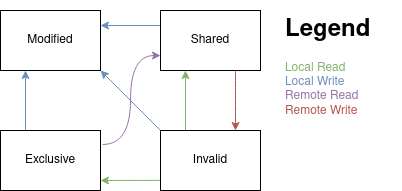

# Cache Coherency and the MESI protocol

I have recently been reading through Ulrich Drepper's [What Every Programmer Should Know About
Memory](https://people.freebsd.org/~lstewart/articles/cpumemory.pdf). Section 3.3.4 Multi-Processor Support explains the
MESI protocol which was new information for me. It is such an interesting concept that I decided to write a blog post
about it.

Because the CPU is magnitudes faster than memory, we want to cache memory for faster access. CPU caches are a rather
complex topic and well documented in Drepper's paper, so I would recommend the interested reader find more information
there. Instead, in this blog post we're interested in communication between CPU cores as they have their own caches.

If there was no overlap between the memory used by different CPU cores, then there would not be a problem. But that is
not the case and various CPU cores need to read and write to the same memory regions. Now, if core A reads memory
location X and simultaneously core B overwrites the same location X, what happens?

Obviously, we need to synchronize so that accesses from various CPU cores don't conflict with each other. Remember, that
because the CPU cache is magnitudes faster than the memory, we need the synchronization to be fast as well. Otherwise,
we lose what we gained by using CPU caches in the first place.

There are different solutions to the problem and while Drepper's paper doesn't mention it, I think they're called *cache
coherency protocols*. One such protocol is the MESI protocol, which is described in Drepper's peper.

The name "MESI" comes from the different states a cache line can be in: **Modified**, **Exclusive**, **Shared** or
**Invalid**. Memory in cache is initially *Invalid*. This means that the data is invalid and must no be used. If we want
to read or write the data, we need to fetch it first.

As we issue a read operation, the memory becomes either *Exclusive* or *Shared*. Which one depends on whether the same
memory is located in the cache memory of another CPU core or not. If it exists in another cache, it is marked as
*Shared*, and if no other cache has the memory, it becomes *Exclusive*.

Note that if a CPU core has the memory marked as *Exclusive*, it can be changed into *Shared* by no operation of the CPU
core itself. If another CPU core fetches the same data, also the memory in this CPU core will tagged as *Shared*.

Now, if we want to write memory, what happens next depends on what state the memory is in. If the state is *Exclusive*,
we can simply modify the data and mark it as *Modified*. Remember that write operations to memory is slow and therefore
it is delayed and not immediately written.

However, if we want to write a cache line that is marked as *Shared*, we need to first issue a Request For Ownership
(RFO) operation. As I understand it, RFO is a broadcast message on the memory bus. I could not find much details on how
it's implemented, and I would assume it's rather complicated.

Let's say that we have core A and core B that both have *Shared* a cache line and now want to write it, i.e. change it
to *Modified*. They both issue the RFO and now they need to synchronize. Only one of the CPU cores can succeed in the
write.

As the state is changed from *Shared* to *Modified* on one CPU core, the state of the cache lines pointing to the same
memory on other cores will change to *Invalid*. Therefore, in the example above, the core whose write failed, now has to
re-retrieve the cache line and only then can it retry writing.

Note that changing state from *Invalid* to *Modified* is not possible in the MESI protocol.

What are my own thoughts about the subject? For years I've wondered how communication and synchronization of cache lines
between cores work. Reading Drepper's paper finally gave me some answers. However, while the paper shortly mentions
legacy protocols, the paper makes it sound like the MESI protocol would be the only protocol in use.

The MESI protocol (and it's variants MOSI and MOESI) are likely the most relevant for the majority of programmers today.
But while MESI is enough on ISA's with strict memory models, it is woefully inadequate for ISA's with relaxed memory
models, such as many RISC architectures including ARMv8 and RISC-V. Instead, we need to use memory barriers to ensure
data consistency over all CPU cores.

The lack of implicit memory consitency on many RISC architectures is actually a good thing because now the CPU doesn't
need to care about cache coherence where not needed. I would love to read more about what kind of protocols are used in
such cases. Probably something very similar to the MESI protocol.
